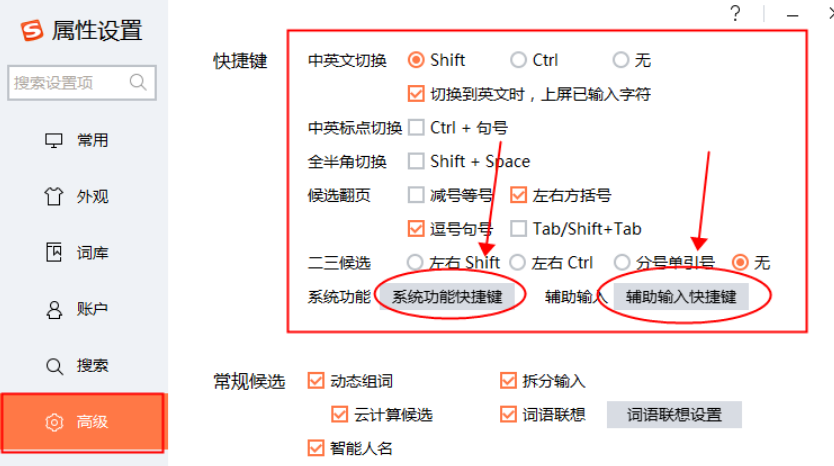

# Vscode笔记


## 快捷键
* 查看全部快捷键(看这个最好):https://code.visualstudio.com/shortcuts/keyboard-shortcuts-windows.pdf
* 网友总结的常用快捷键:https://www.zhihu.com/question/37623310
* [搜狗输入法快捷键冲突问题](#搜狗输入法快捷键冲突问题)

| 功能                         | 快捷键                                      |
| ---------------------------- | ------------------------------------------- |
| 打开终端                     | Ctrl+\`                                     |
| 删除行                       | Ctrl+Shift+K                                |
| 在当前行下插入新的一行       | Ctrl+Enter                                  |
| 旁边窗口的快捷键             |
| Debug窗口                    | Ctrl shift+d                                |
| 多行编辑A方案                | Alt+shift+鼠标左键 或者 鼠标中键/滚轮键按压 |
| 终端切换                     | Ctrl+`                                      |
| 窗口切换                     | Ctrl+1 2                                    |
| 文件切换                     | Alt+1 2                                     |
| 进入编辑器页面(toggle panel) | Ctrl+J                                      |
| 进入终端(toggle terminal)    | Ctrl+`                                      |
| 进入语法错误提示页面         | Ctrl+shift+M                                |
| 跳转到下一个错误的地方       | F8                                          |
| 跳转到定义                   | Ctrl+Click                                  |
| 在侧边文件中显示跳转的定义   | Ctrl+Alt+Click.                             |
| 回到最左边的窗口             | Ctrl+shift+E 之类的 或者 Ctrl+0             |

### F12 

| 英文                        | 功能             | 快捷键                                                          |
| --------------------------- | ---------------- | --------------------------------------------------------------- |
| Go to Definition            | 到定义           | F12 或者 ctrl+]                                                 |
| Go to Declaration           | 到声明           | 无                                                              |
| Go to Type Definition       | 到类型定义       | 无                                                              |
| Go to implementations       | 到实现           | Ctrl+F12                                                        |
| Go to References            | 到引用/提及/参考 | **shift+F12** 会出现一个小窗口供你在所有引用中选择, 或者 ctrl+] |
| Peek Definition             | 瞄一眼定义       | Alt+F12                                                         |
| open definition to the side | 在一边打开定义   | Ctrl+k F12                                                      |


### Ctrl+P
```
? 相当于帮助, 提示你可以使用什么命令
## 跳转到某个符号/标题/变量
```
直接enter: 在原窗口中打开
Ctrl+enter: 在侧边窗口中打开

### vscode cheat sheet 上缺失的快捷键

| 功能                | 命令               |
| ------------------- | ------------------ |
| 面包屑交互          | Ctrl+shift+. 或者; |
| breadcrumb 左右层级 | Ctrl+左右箭头      |

## 常用命令

 | 功能                 | 命令                                               |
 | -------------------- | -------------------------------------------------- |
 | 打开快捷键           | Preferences: Open Keyboard Shortcuts (可以加 json) |
 | 在文件浏览器新建文件 | File: New File                                     |

## 插件

| 名称                      | 功能                                                            |
| ------------------------- | --------------------------------------------------------------- |
| Remote-SSH                | linux远程编程                                                   |
| gitlens                   |
| Git History               | 用来查看git log或则一个文件的git历史，比较不同的分支，commits。 |
| Code Runner               | 支持多种语言的代码的立即执行。                                  |
| Visual Studio IntelliCode | 自动代码不全, 类似另外一个付费的插件TabNine                     |
| Path Intellisense         | 自动路径补全                                                    |
| Image Preview             | 鼠标悬浮在链接或者装订线(gutter)左边可以预览到图片              |
| setting sync              | 貌似现在vscode已经支持内置的同步了                              |
| better comments           | 使注释有人性化的高亮显示 * ! TODO @ 都会有不同的颜色            |


## FAQ
### 搜狗输入法快捷键冲突问题
  

### 在新标签页中打开文件
单击文件名是预览(这时会替换当前的页面)
双击文件名则是在新标签页中打开

如果不想要这个功能的话:
给你配置settings.json里加一条：
"workbench.editor.enablePreview": false,
"workbench.editor.enablePreviewFromQuickOpen": false,

### 打开setting.json 
命令行里直接输入 Open workspace/ setting(json) /user settting

### vscode各种bug?
1. vscode 加载插件需要时间
2. vscode更改设置需要时间(比如切换python的interpreter)
3. 有时候重启vscode就好了

### markdown preview theme 预览主题

https://code.visualstudio.com/docs/languages/markdown#_extending-the-markdown-preview

可以用这个github的markdown的预览样式  如果要自己改的话, 需要学习Css

### winddow下 vscode cmd改为cmder
搜索一下，cmder的github页面上有讲

### Ctrl + space 解决冲突
通常自动补全都是自动生成的，不需要按Ctrl space，不过ctrl space 会被window和搜狗占用

2个方案
1. 修改window对ctrl space 的占用：设置-高级键盘设置-输入语言热键-把Ctrl+space改成其他的，之后重启电脑
2. ctrl +k ctrl +s 修改快捷键为 ` alt + /`
